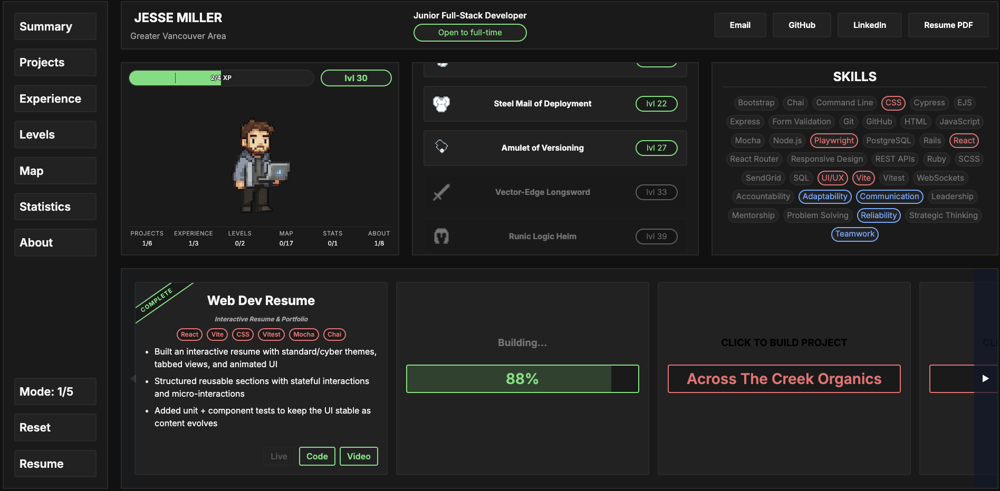
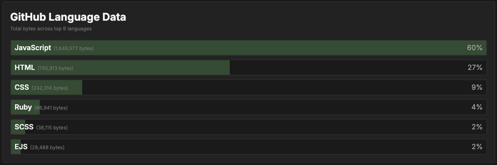
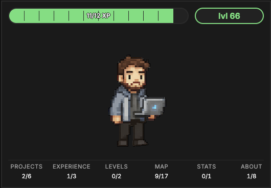

# Web Dev Resume

## About

This is an interactive portfolio built to showcase my full-stack skills, design sensibilities, and attention to detail. The experience is framed as a “character sheet” explorer: projects and experience unlock stats, the skills list updates based on what you’ve built, and the UI supports multiple themes with smooth transitions. It is designed to be fast, playful, and employer-friendly while still demonstrating production-minded patterns.

### Highlights

- Interactive Explorer with progress tracking, XP, and build states.
- GitHub stats panel with optional API enhancement flow.
- Multiple visual themes, responsive layout, and polished micro-interactions.
- Test coverage with unit/component tests and end-to-end flows.

### Tech Stack

- React, Vite, React Router
- CSS (custom design system + theming)
- Vitest, React Testing Library, Playwright

### Why It Matters

This project demonstrates how I approach UX, state management, and reliability. I focus on clean UI architecture, predictable interactions, and testable features, all while keeping the experience engaging and easy to navigate for recruiters.

### Screenshots
Explorer view

Github Languages

Character Card

